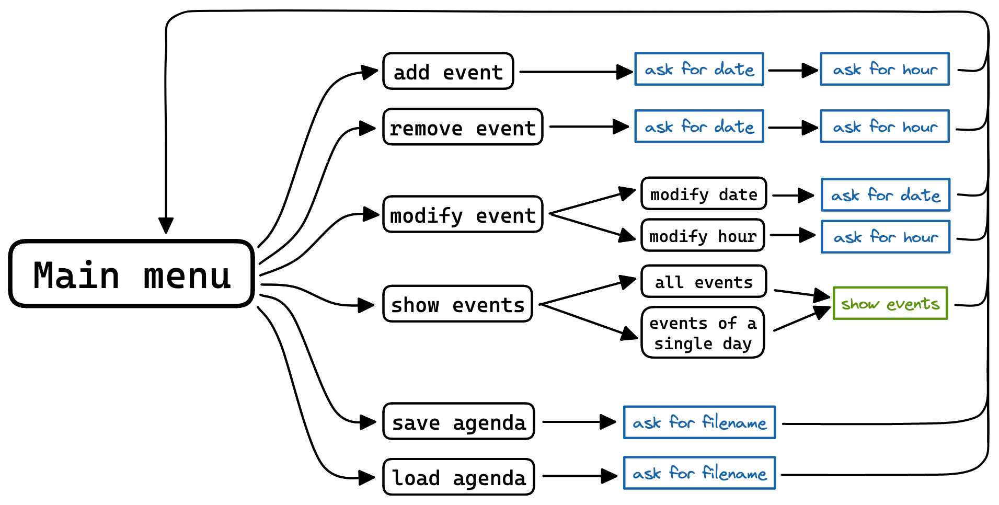
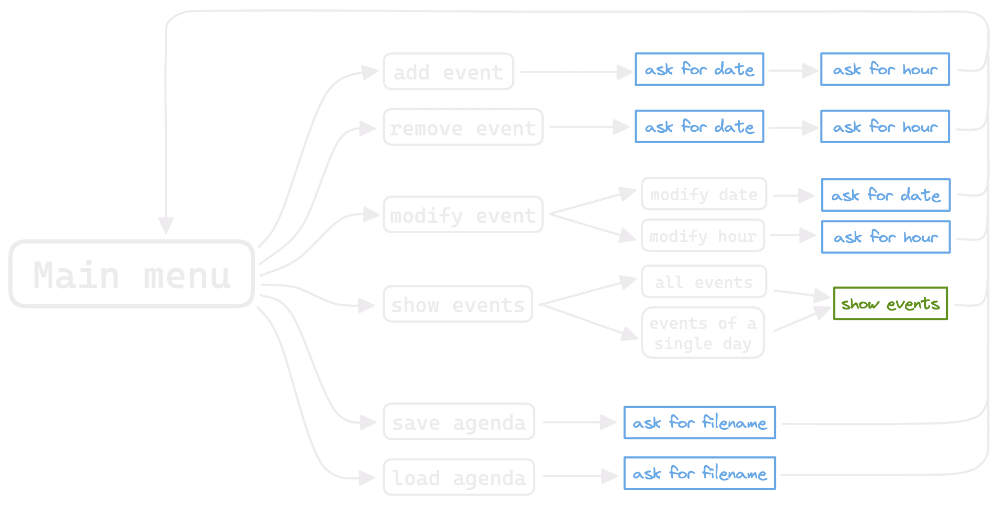

# Compilation

Pour la compilation, on pourra utiliser le `Makefile` fourni.

Le projet à été testé avec `clang` version `14.0.0`, mais devrait fonctionner avec la plupart des compilateurs.

Il est possible de changer la commande utilisée pour appeler le compilateur avec la variable `COMPILER` dans le makefile.

# Roadmap

## Obligatoire

 - [x] ajouter un rendez-vous en précisant la date (Date), l’heure (Heure) et la note (std::string) – 4 points
 - [x] lister et numéroter tous les rendez-vous dans l’ordre croissant de dates/heures – 2 points
 - [x] afficher un rendez-vous saisi dans la liste par son numéro – 2 points
 - [x] reporter/avancer un rendez-vous en entrant le nombre de jours : un nombre positif pour reporter le rendez-vous et un nombre négatif pour avancer le rendez-vous, dont la nouvelle date doit être calculé automatiquement par la class Date – 4 points
 -
 - [x] modifier l’heure d’un rendez-vous – 2 points
 - [x] supprimer un rendez-vous – 2 points
 - [x] enregistrer l’agenda dans le fichier texte agenda.txt – 2 points
 - [x] charger l’agenda à partir du fichier texte agenda.txt – 2 points.

## Bonus
La fonction de recherche vaut 4 points de bonus, jusqu’à 20 points au total :
 - [ ] rechercher les rendez-vous par une date – 2 points
 - [ ] rechercher les rendez-vous par un mot clé – 2 points.

# Diagramme de l'interface

    

